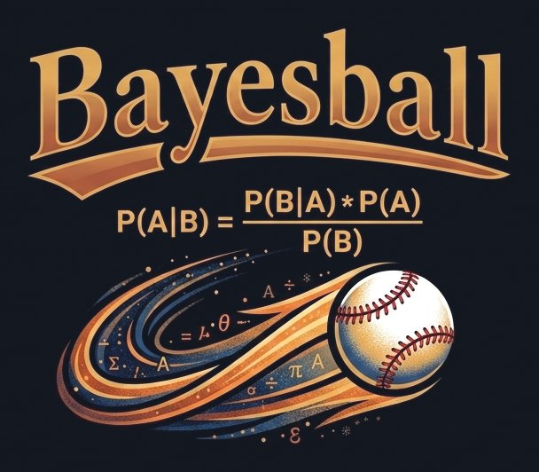

# Bayesball

<p align="center">
  
</p>

Bayesian ratings and match predictions for foosball (1v1 and 2v2 with attack/defence roles),
built to support other games too. See [PLAN.md](PLAN.md) for the full design.

## Run locally

Requires [uv](https://docs.astral.sh/uv/).

```sh
uv sync                                   # install dependencies
uv run uvicorn app.main:app --reload      # start the site at http://localhost:8000
```

On the first start the log shows a one-time link (`No owner account yet. Create it here: …`).
Open it to create your owner account. Anyone can view the site; adding or changing players and
games needs a login, and the owner invites other admins from the **Admins** page.

The JSON API is documented (and can be tried out) at http://localhost:8000/docs; log in on the
site first to use the write endpoints. Locally the data lives in `data/bayesball.db`; set
`DATABASE_URL` to use another database.

| Setting | Meaning |
|---|---|
| `DATABASE_URL` | database address (default: the local SQLite file) |
| `SECRET_KEY` | long random secret that signs login cookies (required online) |
| `SECURE_COOKIES` | `true` to send the login cookie over HTTPS only (online) |
| `PUBLIC_URL` | the site's address, used in setup and invite links |
| `TIMEZONE` | timezone for times typed into forms, e.g. `Europe/Amsterdam` |

## Develop

```sh
uv run pytest            # tests
uv run ruff check .      # lint
uv run ruff format .     # format
```

To run the tests against Postgres too (as CI does), set `TEST_DATABASE_URL` to an empty test
database; it is wiped by every test.

### Changing the database tables

The app updates the database itself at startup, using the migrations in `migrations/versions/`.
After changing `app/models.py`, create a migration, check it, and commit it with the change:

```sh
uv run alembic revision --autogenerate -m "add a location to games"
```

A test fails if the models and the migrations don't match.

## Deploy (Render + Neon)

Every push to `main` runs CI (tests on SQLite and Postgres, plus a Docker build). When CI
passes, Render deploys the new version automatically (`autoDeployTrigger: checksPass` in
`render.yaml`). If the new version doesn't start, the old one keeps running. Render's
**Rollback** button returns to any earlier deploy (a migration that already ran is not undone).

First-time setup:

1. **Neon**: create a project in the Frankfurt region and copy its **direct** connection string
   (Connect → connection pooling off).
2. **Render**: New → **Blueprint** → pick this repository. Paste the Neon connection string when
   it asks for `DATABASE_URL` (Render creates `SECRET_KEY` itself), then deploy.
3. When it is live, open the service's **Logs**, find `No owner account yet. Create it here: …`
   and open that link to create your owner account. The link works once, for one day; every
   restart before then logs a new one.
4. Invite other admins from the **Admins** page.

To try the online database from your laptop, put `DATABASE_URL=…` in `.env` (never committed)
and run `uv run --env-file .env uvicorn app.main:app`.
